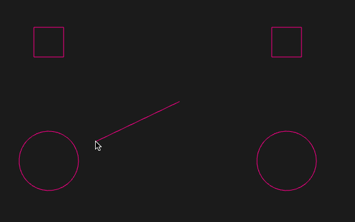
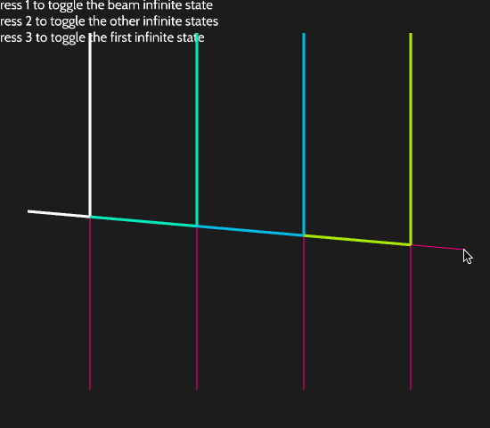
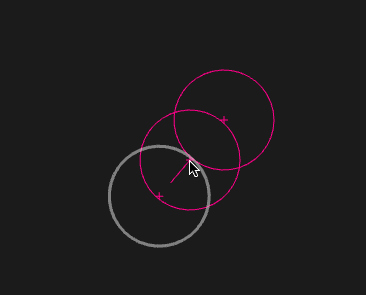
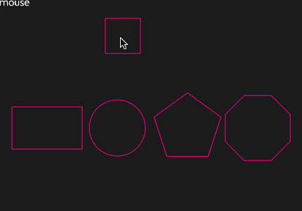

[](./index.html)

---
## What is differ?

A [Separating Axis Theorom](http://en.wikipedia.org/wiki/Hyperplane_separation_theorem) collision library for [haxe](http://haxe.org)

[  ](http://haxe.org)

----

## Facts

- Implements Separating Axis Theorem, for collision detection.
- Supports convex polygons, circles, and rays.
- 2D only (for now).
- Includes a simple drawing interface for debugging shapes
- **COLLISION ONLY.** No physics/response - this is by design.
- Contributions welcome

## Quick look

**A simple collision example**

```haxe
    var circle = new Circle( 300, 200, 50 );
    var box = Polygon.rectangle( 0, 0, 50, 150 );

    box.rotation = 45;

    var collideInfo = Collision.shapeWithShape( circle, box );

    if(collideInfo != null) {
        //use collideInfo.separationX
        //    collideInfo.separationY
        //    collideInfo.normalAxisX
        //    collideInfo.normalAxisY
        //    collideInfo.overlap
    }
```






#### See tests/ for usage examples and tests

### Other notes

- **Not** framework specific
- [Original code ported from rocketmandevelopment blog](http://rocketmandevelopment.com/2010/05/19/separation-of-axis-theorem-for-collision-detection/)

### API documentation

https://snowkit.github.io/differ/

## Demos

- [Playable demo](https://snowkit.github.io/differ/demo/)

# Main Contributors

- [@underscorediscovery](https://github.com/underscorediscovery)
- [@Dvergar](https://github.com/Dvergar)
- [@PDeveloper](https://github.com/PDeveloper)

[view all contributors](https://github.com/snowkit/differ/graphs/contributors)

---

# History

**1.4.0 (github dev)**

**1.3.0 (Latest release, haxelib)**

The goal of this release is as follows : 
- Reduce the usage of Vector internally, simplifying the code to primitives
- Remove allocations, myriads of them the old code had that carried over
- Add ways to reuse allocated results for efficiency when querying
- Add more test/example cases
- Expose the alternative polygon vs shape overlaps to make better choices based on movement
- Move the code more forward to be internally consistent and maintainable
- Fix the bugs with the rays and add more useful infinite flags

All of this was achieved, with the following changes.

- **Refactor** continued clean up
    - remove all allocations in SAT2D, except for results if not provided
    - refactor away internal uses of `Vector`
    - remove superfluous use of `Vector` in the API
        + `ShapeDrawer`: `drawLine`,`drawPoint`
        + `Collision.pointInPoly`
- **Added** `Ray` infinite mode instead of boolean
    - Not infinite
    - Infinite from start position
    - Infinite in both directions
- **Added** `Rays` test in usage0
- **Added** ShapeCollision/RayCollision/RayIntersection
    - added `clone()`, `copy_from(other)`, `reset()`
- **Added** differ.math.Util
    - removes internal SAT2D use of the `Vector` class
- **Added** `into` argument for all internal and external calls
    - this reuses the existing instance for the result
    - all calls will always reset the collision result
    - all direct calls still return null as "no result"
    - added `Results<T>` results cache helper
    - all plural calls return `Results<T>`
- **Fixed** Bug in `testCircleVsPolygon`
    - When testing polygon vs circle values were flipped/wrong
- **Fixed** Bug in `rayVsRay` with a negative overlap
- **Removed** `Common` util class, it's internal to SAT2D and simplified now 
- **Removed** `drawVector` in `ShapeDrawer`, wasn't used (use `drawLine` if needed)

**1.2.0**

 The biggest change for sure, renamed `hxcollision` to `differ`
 Now that the library is getting more use its better to have a consistent name
 and to have a more explicit path. Think of "differ" as a diff tool for shapes/rays, 
 it tells you how shapes differ (i.e the separation).

 - **Added** ray collision information, rather than just true/false
 - **Added** ray vs ray intersection with info on overlap
 - **Added** more granular tests, that will expand further
    - New test case uses luxe https://luxeengine.com/
    - hxcollision/differ was born for luxe.collision, separate for any framework
 - **Refactor** continued separating code for future 3D vs 2D
    - moved all internal 2D code into differ.sat.SAT2D
    - moved all internal common code into differ.sat.Common
 - **Renamed** `Collision.test` to `Collision.shapeWithShape`
 - **Renamed** `Collision.testShapes` to `Collision.shapeWithShapes`
 - **Renamed** `Collision.rayShape` to `Collision.rayWithShape`
 - **Renamed** `Collision.rayShapes` to `Collision.rayWithShapes`
 - **Renamed** `Collision.rayRay` to `Collision.rayWithRay`
 - **Renamed** `Collision.rayRays` to `Collision.rayWithRays`
 - **Renamed** `Collision.rayRays` to `Collision.rayWithRays`
 - **Renamed** `data.CollisionData` to `data.ShapeCollision`
 - **Renamed** `data.RayCollisionData` to `data.RayCollision`
 - **Renamed** `data.RayIntersectionData` to `data.RayIntersection`
 - **Removed** `OpenFLDrawer`, will replace with gist or test later

**1.1.0**
 - **Added** documentation and clean up of code
 - **Renamed** `Vector2D` to `Vector` and cleaned up code to ONLY what is needed. This class is meant to be as small and easy to integrate as possible.   
 - **Refactor** for easier maintaining in embedded libraries   
 - **Renamed** `BaseShape` to `Shape`, continued refactoring
 - **Renamed** `Collision.testShapes` to `Collision.test`
 - **Renamed** `Collision.testShapeList` to `Collision.testShapes`
 - **Renamed** `Collision.rayCollision` to `Collision.ray`
 - **Fixed** various bugs in collisions
 - **Fixed** `separation`/`unitVector` behaviour (signs bugs)
 - **Fixed** bug with `Polygon`/`Polygon` collisions not returning best vectors 
 - **Fixed** bug where you couldn't `beginFill` using `OpenFLDrawer`
 - **Fixed** `collisionData` in `CheckCircles`, shape2 wasn't assigned.
 - **Fixed** `separation`/`unitVector` is now bound to shape1 as it should be
 - **Added** 2 samples (usage2 & usage3)
 - **Added** `drawVector` in `OpenFLDrawer` showing vector direction
 - **Added** `drawShape` in `ShapeDrawer`, will cast proper types and call appropriate drawing functions.

**1.0.4**
 - **Renamed** `Polygon.normalPolygon` to `Polygon.create`
 - **Added** `testShapeList` for testing one shape with many
 - **Added** changes to the test to display the `unitVector` response (soon to be renamed also)
 - **Refactor** to more integration friendly api, and more logical order of arguments for shapes. 
 - **Fixed** rotation on the base shapes absolute (submitted by @grapefrukt). 
 - **Added** name and data flag to `BaseShape`

**1.0.3**
 - **Fixed** bug in circle vs polygon, when polygon was rotated.
 - **Added** line raycast with collision shapes
 - **Added** a custom `ShapeDrawer` class, for drawing the shapes in a non specific way. 
 - **Update** to latest haxelib revisions
 - Removed dependency on OpenFL, now completely standalone 

**1.0.2**
 - uncommitted internal fixes

**1.0.1**
 - **Added** an option for `Polygon.rectangle()` to be non-centered

**1.0.0**
 - Initial project pull and compile/port, functional

---

&nbsp;
