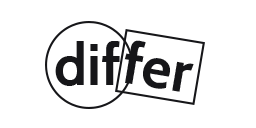

--- 
## About

A [Separating Axis Theorom](http://en.wikipedia.org/wiki/Hyperplane_separation_theorem) collision library for [haxe](http://haxe.org)

----

##Demo

- [usage demo 1](http://underscorediscovery.com/sven/hxcollision/usage1)
- [usage demo 2](http://underscorediscovery.com/sven/hxcollision/usage2)
- [usage demo 3](http://underscorediscovery.com/sven/hxcollision/usage3)

## Facts

- This is a port of Separating Axis Theorem, for collision detection between shapes.
- Supports polygons and circles, currently.
- Includes a simple drawing interface for debugging shapes
- **COLLISION ONLY.** No physics here. By design :)
- Contributions welcome

### Other notes 

- **not** specific to OpenFL
- See tests/ for some OpenFL usage examples.
- Includes a drawing class for seeing shapes with OpenFL

### More Notes

- [Original code ported from rocketmandevelopment blog](http://rocketmandevelopment.com/2010/05/19/separation-of-axis-theorem-for-collision-detection/)

##Quick look

**A simple collision example**

    var circle = new Circle( 300, 200, 50 );
    var box = Polygon.rectangle( 0, 0, 50, 150 );

    box.rotation = 45;

    var collideInfo = Collision.test( circle, box );

    if(collideInfo != null) {
    	//use collideInfo.separation.x
    	//use collideInfo.separation.y
    }

----

##Documentation

###[View API](https://underscorediscovery.github.io/hxcollision/)   

---

## Getting Started

`haxelib install hxcollision`

or 

`haxelib git hxcollision https://github.com/underscorediscovery/hxcollision.git`

or git clone the repo, from here. Then use 

`haxelib dev hxcollision /path/to/repo`

## Building the usage examples

To build the usage examples in the `test/` folder :

- install http://openfl.org
- `lime test flash` (or any openfl target)

#Main Contributors

- [@underscorediscovery](http://github.com/underscorediscovery)
- [@Dvergar](http://github.com/Dvergar)

#Recent changes

**1.1 (Latest repo)**
 - Added documentation and clean up of code
 - Renamed `BaseShape` to `Shape`, continued refactoring
 - Renamed `Collision.testShapes` to `Collision.test`
 - Renamed `Collision.testShapeList` to `Collision.testShapes`
 - Renamed `Collision.rayCollision` to `Collision.ray`
 - Fixed various bugs in collisions
 - Fixed `separation`/`unitVector` behaviour (signs bugs)
 - Fixed bug with `Polygon`/`Polygon` collisions not returning best vectors 
 - Fixed bug where you couldn't `beginFill` using `OpenFLDrawer`
 - Fixed `collisionData` in `CheckCircles`, shape2 wasn't assigned.
 - `separation`/`unitVector` is now bound to shape1
 - Added 2 samples (usage2 & usage3)
 - Added `drawVector` in `OpenFLDrawer` showing vector direction
 - Added `drawShape` in `ShapeDrawer`, will cast proper types and call appropriate drawing functions.

**1.0.4 (Latest release, haxelib)**
 - Renamed `Polygon.normalPolygon` to `Polygon.create`
 - Added `testShapeList` for testing one shape with many
 - Added changes to the test to display the `unitVector` response (soon to be renamed also)
 - Migrating to more integration friendly api, and more logical order of arguments for shapes. 
 - Making rotation on the base shapes absolute (submitted by @grapefrukt). 
 - Adding name and data flag to `BaseShape`

**1.0.3**
 - Fixed bug in circle vs polygon, when polygon was rotated.
 - Added line raycast with collision shapes
 - Added a custom `ShapeDrawer` class, for drawing the shapes in a non specific way. 
 - Moved to latest haxelib revisions
 - Removed dependency on OpenFL, now completely standalone 
 
**1.0.2**
 - uncommitted internal fixes

**1.0.1**
 - Added an option for `Polygon.rectangle()` to be non-centered
 
**1.0.0** 
 - Initial project pull and compile/port, functional

---

&nbsp;

